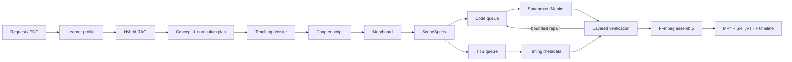
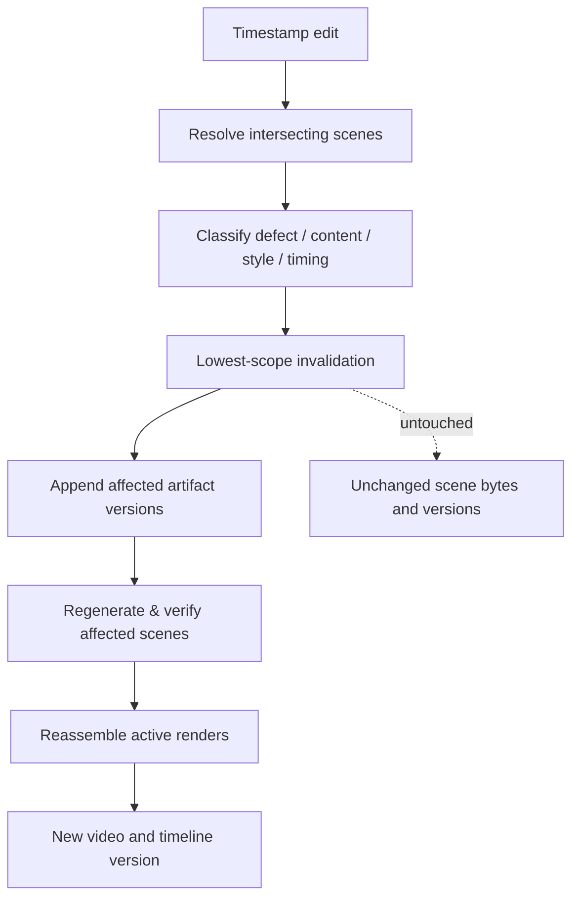

# ScholarMotion

ScholarMotion turns a learner-aware request or a research paper into a source-grounded, narrated [Manim](https://www.manim.community/) lesson with subtitles.

Its unit of work is a small, immutable **scene artifact** — not one monolithic generated Python file. A user can edit a single timestamp range and ScholarMotion regenerates only the scenes that intersect that range, then reassembles a new video version. Untouched scenes are preserved byte-for-byte.

The repository runs end-to-end **without any API keys** in deterministic mock mode. Production mode uses PostgreSQL/pgvector, Redis/Celery, Manim, FFmpeg, and pluggable LLM/TTS/embedding/storage providers.

---

## Submission materials

Everything for this submission lives in this repository, plus one hosted recording:

| | What it is |
|---|---|
| 📄 **[README.md](README.md)** | This document — architecture, the Exasol data platform, and how retrieval is pushed into the database. |
| 🛠️ **[RUN_GUIDE.md](RUN_GUIDE.md)** | Copy-pasteable setup for both Docker and local Python, plus troubleshooting. **Start here.** |
| 📊 **[Slides](ScholarMotion_Exasol_Hackathon.pdf)** | Presentation deck (PDF). |
| 📹 **[Video recording](https://drive.google.com/file/d/1YOe2v-PkURsFBGM8P50BJUI6OpTKLMtx/view?usp=sharing)** | Recorded walkthrough of the system running end to end. |

---

## Data platform — Exasol

**Exasol is ScholarMotion's primary data platform for the knowledge corpus**, which is the data the product is actually about: every ingested NCERT chapter and research paper, chunked, embedded, and concept-tagged. No lesson is ever planned without it — retrieval against Exasol runs on the critical path of *every* generation, before a single scene exists.

The split is deliberate:

| Concern | Platform | Why |
|---|---|---|
| **Source corpus + retrieval + analytics** | **Exasol** | Scan-heavy, read-mostly, analytical. Every build scores the *entire* corpus against one query vector, then aggregates coverage across it. Columnar MPP work. |
| Project/scene state, versions, progress events | PostgreSQL / SQLite | Row-at-a-time transactional churn — appending artifact versions, flipping active flags. |
| Queue / broker | Redis + Celery | — |
| Object storage | Local FS or S3/MinIO | Rendered media, not queryable data. |

### How retrieval runs inside Exasol

The whole hybrid scoring blend is pushed down into the database — vector similarity, lexical overlap, concept-graph overlap, exact-phrase presence — and only the final ranked page crosses the wire. There are two scoring paths:

- **UDF path** — a `COSINE_SIMILARITY` **Exasol Python UDF** runs on the data node against the packed `EMBEDDING_JSON` column.
- **SQL path** — the dot product is a `JOIN` against the query vector plus a `GROUP BY SUM` over `CHUNK_EMBEDDINGS`, a long/narrow (chunk, dimension, value) table. This is the columnar-idiomatic form and needs no script-creation privileges.

Embeddings are unit-normalised once at ingest, so that `SUM(VALUE * VALUE)` **is** the cosine. The retriever prefers the UDF, checks `SYS.EXA_ALL_SCRIPTS` to confirm it is deployed, and falls back to the SQL path otherwise — so a locked-down instance degrades in performance, never in correctness.

Schema (created automatically by `bootstrap`):

| Table | Holds |
|---|---|
| `SOURCE_DOCUMENTS` | Document identity, kind, title, URI, authors |
| `SOURCE_CHUNKS` | Chunk metadata, text, concept tags, packed `EMBEDDING_JSON` |
| `CHUNK_EMBEDDINGS` | One row per (chunk, dimension) — the columnar vector form |

Ingestion loads via `import_from_iterable`, Exasol's **parallel CSV import**, rather than per-row INSERTs — which is what makes loading a full NCERT volume practical.

Implementation: [persistence/exasol.py](src/scholarmotion/persistence/exasol.py) and [retrieval/exasol_retrieval.py](src/scholarmotion/retrieval/exasol_retrieval.py).

### Retriever selection

`ExasolHybridRetriever` is the third implementation of one contract, chosen in [`retrieve_context`](src/scholarmotion/api/service.py). All three return `RetrievedChunk`, so the pipeline is indifferent to which ran:

| Retriever | Used when |
|---|---|
| `ExasolHybridRetriever` | `EXASOL_ENABLED=true` — the production path |
| `PostgresHybridRetriever` | Exasol disabled/unreachable and the store is PostgreSQL |
| `HybridRetriever` | Otherwise (in-process, SQLite/dev) |

If Exasol is unreachable mid-build the generation logs a warning and degrades to a local backend rather than failing — a grounded lesson from the fallback beats no lesson.

### Corpus analytics

`GET /corpus/analytics` runs full-corpus aggregations in Exasol: chunk/document/subject totals, coverage per class/subject/chapter, content-type mix, and chapters too thin to teach from. `GET /corpus/health` reports reachability and which scoring path is live.

Verify the whole integration end-to-end:

```bash
python scripts/verify_exasol.py
```

It connects, bootstraps, bulk-loads a labelled corpus, runs the query on both scoring paths, and prints each ranking. It is idempotent — chunk ids are deterministic, so re-runs replace rather than accumulate.

**Verified against Exasol Personal 2.2.0 (local, macOS arm64):**

```
→ Loaded 4 chunks via Exasol bulk import
  SOURCE_CHUNKS=4 rows, CHUNK_EMBEDDINGS=1536 rows
→ Query: "How does a changing magnetic flux induce an emf in a coil?"
    1. score=+0.3013  Faraday's law states that the induced emf ...
    2. score=+0.1958  Lenz's law fixes the direction of the induced current ...
    3. score=+0.1039  A photodiode converts incident light into current ...
    4. score=+0.0713  The ideal gas law relates pressure, volume ...
```

### Platform notes

`exasol/docker-db` is x86_64-only and **does not run on Apple Silicon** — it stalls before starting the database. On macOS use the native **Exasol Personal** launcher (`curl https://www.exasol.com/install/ | sh` then `exasol install local`); the Compose service is for x86_64 Linux hosts.

Local Exasol Personal ships **without the Python3 script language container**, so the `COSINE_SIMILARITY` UDF cannot be deployed there and retrieval runs the columnar SQL path. This is exactly the case the fallback exists for, and it is the configuration the numbers above were produced under. The UDF path remains available on deployments that include the container.

Two dialect details the implementation depends on: `SECTION`, `TEXT` and `VALUE` are reserved words and are double-quoted throughout; and pyexasol interpolates `{name}` placeholders (with `!d` for numerics), not `:name`.

---

## Architecture



Selective regeneration on an edit:



### Code map

| Path | Responsibility |
|---|---|
| [src/scholarmotion/api/](src/scholarmotion/api/) | FastAPI app ([main.py](src/scholarmotion/api/main.py)) and the orchestration service ([service.py](src/scholarmotion/api/service.py)) |
| [src/scholarmotion/agents/](src/scholarmotion/agents/) | Profiler, curriculum, pedagogy, script writer, storyboard, scene compiler, code generator, correction curator |
| [src/scholarmotion/tasks/](src/scholarmotion/tasks/) | Celery app and per-queue tasks (planning, generation, tts, render, verification, assembly, editing) |
| [src/scholarmotion/verification/](src/scholarmotion/verification/) | Render, layout, visual, math, semantic, pedagogy checks + aggregator |
| [src/scholarmotion/retrieval/](src/scholarmotion/retrieval/) | NCERT/paper ingestion, hybrid retrieval (incl. [Exasol](src/scholarmotion/retrieval/exasol_retrieval.py)), reranking, context building |
| [src/scholarmotion/memory/](src/scholarmotion/memory/) | Correction memory, style registry, source ledger, concept graph, scene manifest |
| [src/scholarmotion/persistence/](src/scholarmotion/persistence/) | SQLAlchemy models, async engine, object storage, [Exasol client](src/scholarmotion/persistence/exasol.py) |
| [src/scholarmotion/providers/](src/scholarmotion/providers/) | LLM / TTS / embedding provider factory |
| [frontend/app.py](frontend/app.py) | Streamlit UI with the seek-and-edit video component |
| [alembic/](alembic/) | Schema migrations (`0001_initial`) |

---

## Quick start (Docker)

Requirements: Docker + Docker Compose. Manim and FFmpeg ship inside the application image.

```bash
cp .env.example .env
docker compose up -d --build
docker compose exec api alembic upgrade head
```

Open:

- Streamlit UI — <http://localhost:8501>
- API docs — <http://localhost:8000/docs>
- MinIO console — <http://localhost:9001> (`minio` / `miniosecret`)

Full instructions, including the keyless local Python path, are in the **[Run Guide](RUN_GUIDE.md)**.

---

## Configuration

Every setting is an environment variable, loaded from `.env` then `.env.local` (see [src/scholarmotion/config/settings.py](src/scholarmotion/config/settings.py)). `.env.local` is gitignored so a local deployment can override checked-in defaults without putting credentials in source control.

| Area | Variables |
|---|---|
| **Exasol (corpus platform)** | `EXASOL_ENABLED`, `EXASOL_DSN`, `EXASOL_USER`, `EXASOL_PASSWORD`, `EXASOL_SCHEMA`, `EXASOL_USE_UDF` |
| Database / jobs | `DATABASE_URL`, `REDIS_URL`, `CELERY_TASK_ALWAYS_EAGER` |
| LLM | `MAIN_LLM_PROVIDER`, `MAIN_LLM_API_KEY`, `MAIN_LLM_MODEL`, `MAIN_LLM_BASE_URL`, `MAIN_LLM_TEMPERATURE` |
| Optional vision | `VISUAL_LLM_PROVIDER`, `VISUAL_LLM_API_KEY`, `VISUAL_LLM_MODEL` |
| TTS | `TTS_PROVIDER`, `TTS_API_KEY`, `TTS_MODEL`, `TTS_BASE_URL`, `TTS_VOICE` |
| Embeddings | `EMBEDDING_PROVIDER`, `EMBEDDING_MODEL`, `EMBEDDING_DIMENSIONS` |
| Storage | `OBJECT_STORAGE_BACKEND`, `OBJECT_STORAGE_ROOT`, `S3_*` |
| Limits | `MAX_CONCURRENT_SCENES`, `MAX_RENDER_WORKERS`, `MAX_LLM_REQUESTS`, `RENDER_TIMEOUT_SECONDS` |
| Binaries | `FFMPEG_BINARY`, `MANIM_BINARY` |

**Supported providers** (from [providers/factory.py](src/scholarmotion/providers/factory.py)):

- LLM — `mock` (default), `anthropic`, `gemini`, `openai`, `openai_compatible`
- TTS — `mock` (default), `elevenlabs`, `kokoro_http`, `openai` / `openai_compatible`
- Embeddings — `local` (sentence-transformers, default), `openai` / `openai_compatible`

Adapters are capability-aware. If the main provider cannot inspect images, deterministic render/layout/math/pedagogy verification still runs and only multimodal verification is skipped. API keys are never persisted in prompt history.

---

## Running individual services

```bash
make install        # pip install -e ".[dev]"
make services       # Exasol, PostgreSQL/pgvector, Redis, MinIO
make exasol         # Exasol alone
make exasol-verify  # end-to-end Exasol check (both scoring paths)
make migrate        # alembic upgrade head
make api            # uvicorn scholarmotion.api.main:app --reload
make worker         # Celery worker across all named queues
make ui             # streamlit run frontend/app.py
```

Celery queues are routed by task module in [tasks/celery_app.py](src/scholarmotion/tasks/celery_app.py): `planning`, `code_generation`, `tts`, `render`, `verification`, `assembly`, `feedback`. The worker interface is deliberately provider-neutral so a Temporal adapter could replace Celery without changing scene contracts.

---

## Ingesting NCERT material

ScholarMotion does not redistribute copyrighted books. Place PDFs under `data/ncert/` — ideally in paths containing class and subject names — then run:

```bash
python scripts/ingest_ncert.py data/ncert/
```

The ingester records class, subject, book, chapter/section, page, content type, text, equations, examples, definitions, concept/prerequisite tags, and a local sentence-transformer embedding. With `EXASOL_ENABLED=true` the corpus is bulk-loaded into Exasol via its parallel CSV import — that copy is what retrieval queries at build time. The transactional store keeps its own copy for provenance (pgvector on PostgreSQL, JSON on SQLite). Retrieval combines metadata filtering, vector similarity, lexical relevance, concept expansion, and heuristic reranking.

Research papers can be uploaded from the Streamlit sidebar or via `POST /projects/{id}/sources`. Parsing preserves page/section provenance and labels equation, figure, and table references, so a request like *"Explain Equation 7"* or *"Explain Figures 2 and 3"* resolves to specific source chunks. Claims marked `direct` or `derived` cannot enter the source ledger without provenance.

---

## Creating a video

### From the UI

Start the API and Streamlit (see the [Run Guide](RUN_GUIDE.md)), open <http://localhost:8501>, then:

1. **Sidebar → New lesson** — give it a title, describe what you don't understand in your own
   words, set a target duration, and click **Create lesson**.
2. Select the lesson and click **Generate lesson**. The event feed shows each stage as it runs
   (retrieval → curriculum → script → storyboard → code → speech → render → verify → assemble).
3. When it finishes the video plays inline, with a **Download MP4** button.

A 3-minute lesson takes roughly 3 minutes to build on an M-series laptop with Gemini and a
local Kokoro server.

### From the API

Via the Streamlit chat form, or the API:

```bash
curl -X POST http://localhost:8000/projects \
  -H "content-type: application/json" \
  -d '{"title":"Eigenvectors","request":"I understand matrices but not linear transformations. Explain eigenvectors visually.","target_duration_minutes":5,"language":"English"}'

curl -X POST http://localhost:8000/projects/PROJECT_ID/generate
curl http://localhost:8000/projects/PROJECT_ID/progress
```

Each stage writes an append-only artifact. Scene paths follow `projects/<project>/scenes/S01/{spec,code,audio,render}/vN.*`. The database selects active versions and records dependencies, invocations, timings, verification results, repairs, and progress events.

---

## Editing a video

### From the UI

Under a generated lesson, open **Refine a section**. It shows the scene timeline with each
scene's current render version, then takes:

| Field | Example |
|---|---|
| From | `1:24` (also accepts `84` or `1;24`) |
| To | `2:30` |
| What should change | `Explain this part more slowly, using a simpler everyday example.` |

Before submitting it tells you which scenes overlap that window. After the rebuild, refresh and
compare render versions in the same table — the scenes outside your range keep their old version
number, which is the selective regeneration made visible.
